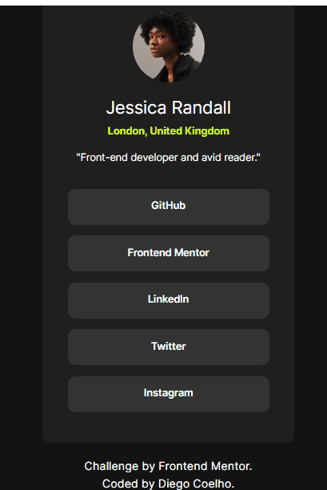

# Quarto Desafio FrontEnd Mentor Social links profile
Abordando conceito da propriedade flex, hover e links para outras páginas.
## Tecnologias utilizadas
- HTML5
- CSS3
## Objetivos
- Praticar os conteúdos do curso
- Responsividade.
- Alinhamento dos elementos.
- Links e propriedade hover.
## Prévia da aplicação
[]
